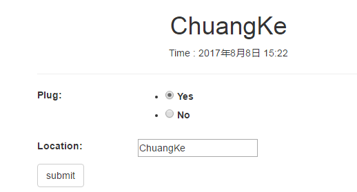
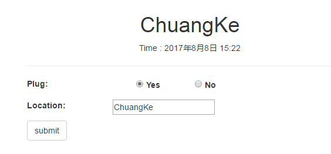
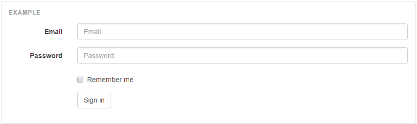

# 表单显示 Form
## 内联单选框 inline
方法一

设置form中的field为 ChoiceField / RadioSelect，在template中它会以ul,li方式进行显示
``` python
class OfficeInspectionForm(forms.ModelForm):
      
    plug = forms.ChoiceField(
            choices=RESULT_OPTION,
            widget = forms.RadioSelect,
            )
```
template中显示如下，各个选项(Yes, No0是竖着显示的，排版不够美观，也不符合纸质使用习惯
``` html
<ul id="id_plug">
  <li>
    <label for="id_plug_0"><input checked="checked" id="id_plug_0" name="plug" type="radio" value="yes"> 
      Yes
    </label>
  </li>
  <li>
    <label for="id_plug_1"><input id="id_plug_1" name="plug" type="radio" value="no"> 
      No
    </label>
  </li>
</ul>
```
显示效果如下



### 隐藏li的默认样式 (去掉圆点)
首选去掉圆点
``` javascript
<style type="text/css">


.field ul{
	list-style:none;
}


</style>
```

### 添加浮动属性
``` javascript

.field li{
	float:left;
}

```
修改后效果



### 参考
[ul li css 做横向菜单](http://www.cnblogs.com/amylis_chen/archive/2011/09/24/2188398.html)

**方法二**

给ul添加两个class .list-inline和.list-unstyled  

list-unstyled
> 移除默认的列表样式，列表项中左对齐 ( \<ul\> 和 \<ol\> 中)。 这个类仅适用于直接子列表项 (如果需要移除嵌套的列表项，你需要在嵌套的列表中使用该样式)	

list-inline
> 将所有列表项放置同一行	

### 参考
http://www.runoob.com/bootstrap/bootstrap-typography.html
	
## 水平表单
参考 http://getbootstrap.com/css/#forms-horizontal

{{ form|crispy }}的显示效果为label单独行，这个对于有些模板排版就不会那么好看

参考bootstrapp horizontal form效果，实现类似效果



它的代码如下：
``` html
<form class="form-horizontal">
  <div class="form-group">
    <label for="inputEmail3" class="col-sm-2 control-label">Email</label>
    <div class="col-sm-10">
      <input type="email" class="form-control" id="inputEmail3" placeholder="Email">
    </div>
  </div>
  <div class="form-group">
    <label for="inputPassword3" class="col-sm-2 control-label">Password</label>
    <div class="col-sm-10">
      <input type="password" class="form-control" id="inputPassword3" placeholder="Password">
    </div>
  </div>
  <div class="form-group">
    <div class="col-sm-offset-2 col-sm-10">
      <div class="checkbox">
        <label>
          <input type="checkbox"> Remember me
        </label>
      </div>
    </div>
  </div>
  <div class="form-group">
    <div class="col-sm-offset-2 col-sm-10">
      <button type="submit" class="btn btn-default">Sign in</button>
    </div>
  </div>
</form>
```
参考它的实现，在项目的实现如下
inspection/horizontal_form.html
``` html
<form class="form-horizontal" method="POST" action=''>
    
        <p style="color: #b75f33;">
            {{form.non_field_errors}}
        </p>
    

    
        
            <div>{{ field }}</div>
        
            <div class="error" style="color:#b75f33">{{ field.errors }}</div>
            <div class="field-area form-group  error">                
                {{ field.label_tag }}                
                <div class="col-sm-10">
                    {{ field }}
                </div>
            </div>
                    
    
    <input type="submit" name="submit" class="btn btn-default" value="submit"/>
</form>
```

template里面添加下面的css
``` html

<script>


$(document).ready(function(){
	$(".field-area input").addClass("form-control");
	$(".field-area textarea").addClass("form-control");
	$(".field-area>label").addClass("col-sm-2 control-label");
});


</script>
```

1. 改例子没有明确地写出每个field的名字，对应的属性(widget, readonly, disable, exclude)可以在form中设置  
2. 显示label内容使用了```{{ field.label_tag }}```，显示field本身```{{ field }}```，这儿无法把 css class 加进去，所以通过JavaScript在页面ready时把label的```control-label```和field的```form-control```添加进去了  
3. column宽度，lable直接添加在label内添加col-sm-2，field的在div里面添加col-sm-10


# 表格
## 自适应表格
http://caibaojian.com/responsive-tables.html  
http://blog.sina.com.cn/s/blog_66d8992d0100pb5i.html

# 多选框、
正常的设置之后，多选框总是无法初始化选择
``` python
class DailyInspectionForm(forms.ModelForm):
   
    impact = forms.MultipleChoiceField(
            choices = lambda: (item for item in DailyInspection.daily_insepction_impact),
            widget = forms.SelectMultiple(),
            #widget=forms.CheckboxSelectMultiple(),
            initial = ['environment'],
            required=True
            )
```
最后查下来应该是django代码bug

```
class SelectMultiple(Select):
    allow_multiple_selected = True

    def render(self, name, value, attrs=None, choices=()):
        if value is None:
            value = []
        final_attrs = self.build_attrs(attrs, name=name)
        output = [format_html('<select multiple="multiple"{}>', flatatt(final_attrs))]
        options = self.render_options(choices, value)
        if options:
            output.append(options)
        output.append('</select>')
        return mark_safe('\n'.join(output))

    def value_from_datadict(self, data, files, name):
        if isinstance(data, (MultiValueDict, MergeDict)):
            return data.getlist(name)
        return data.get(name, None)
	
class Select(Widget):

    def render_options(self, choices, selected_choices):
        # Normalize to strings.
        selected_choices = set(force_text(v) for v in selected_choices)
        output = []
        for option_value, option_label in chain(self.choices, choices):
            if isinstance(option_label, (list, tuple)):
                output.append(format_html('<optgroup label="{}">', force_text(option_value)))
                for option in option_label:
                    output.append(self.render_option(selected_choices, *option))
                output.append('</optgroup>')
            else:
                output.append(self.render_option(selected_choices, option_value, option_label))
        return '\n'.join(output)	
```
```selected_choices = set(force_text(v) for v in selected_choices)```这句话应该改为
``` python
selected_choices = set([force_text(v) for v in selected_choices])
```

参考
- https://stackoverflow.com/questions/9993939/django-display-values-of-the-selected-multiple-choice-field-in-a-template
- https://stackoverflow.com/questions/23572341/initializing-a-multiplechoicefield-in-django-cms
- https://codedump.io/share/cRQMqEnmg5HD/1/django-setting-initial-vals-of-multiplechoicefield-only-works-first-time
- https://stackoverflow.com/questions/25534811/django-display-selected-choices-in-multiplechoicefield
- http://www.programcreek.com/python/example/58199/django.forms.MultipleChoiceField
- https://pypi.python.org/pypi/django-multiselectfield
- [django下ChoiceField等, queryset 动态设定](http://blog.csdn.net/kevin6216/article/details/7103078)

# ImageField 删除
``` python
class FileField(Field):
    def pre_save(self, model_instance, add):
        "Returns field's value just before saving."
        file = super(FileField, self).pre_save(model_instance, add)
        if file and not file._committed:
            # Commit the file to storage prior to saving the model
            file.save(file.name, file, save=False)
        return file
```

``` python
class FieldFile(File):
    def save(self, name, content, save=True):
        name = self.field.generate_filename(self.instance, name)

        args, varargs, varkw, defaults = getargspec(self.storage.save)
        if 'max_length' in args:
            self.name = self.storage.save(name, content, max_length=self.field.max_length)
        else:
            warnings.warn(
                'Backwards compatibility for storage backends without '
                'support for the `max_length` argument in '
                'Storage.save() will be removed in Django 1.10.',
                RemovedInDjango110Warning, stacklevel=2
            )
            self.name = self.storage.save(name, content)

        setattr(self.instance, self.field.name, self.name)

        # Update the filesize cache
        self._size = content.size
        self._committed = True

        # Save the object because it has changed, unless save is False
        if save:
            self.instance.save()
    save.alters_data = True
```

如果是新浪云保存，下面的类要替换掉
django.core.file.storage
```
class Storage(object):
    def save(self, name, content, max_length=None):
        """
        Saves new content to the file specified by name. The content should be
        a proper File object or any python file-like object, ready to be read
        from the beginning.
        """
        # Get the proper name for the file, as it will actually be saved.
        if name is None:
            name = content.name

        if not hasattr(content, 'chunks'):
            content = File(content)

        args, varargs, varkw, defaults = getargspec(self.get_available_name)
        if 'max_length' in args:
            name = self.get_available_name(name, max_length=max_length)
        else:
            warnings.warn(
                'Backwards compatibility for storage backends without '
                'support for the `max_length` argument in '
                'Storage.get_available_name() will be removed in Django 1.10.',
                RemovedInDjango110Warning, stacklevel=2
            )
            name = self.get_available_name(name)

        name = self._save(name, content)

        # Store filenames with forward slashes, even on Windows
        return force_text(name.replace('\\', '/'))

```


- http://timonweb.com/posts/cleanup-files-and-images-on-model-delete-in-django/
- https://stackoverflow.com/questions/41329858/how-to-delete-an-imagefield-image-in-a-django-model
- https://docs.djangoproject.com/en/1.11/topics/signals/

